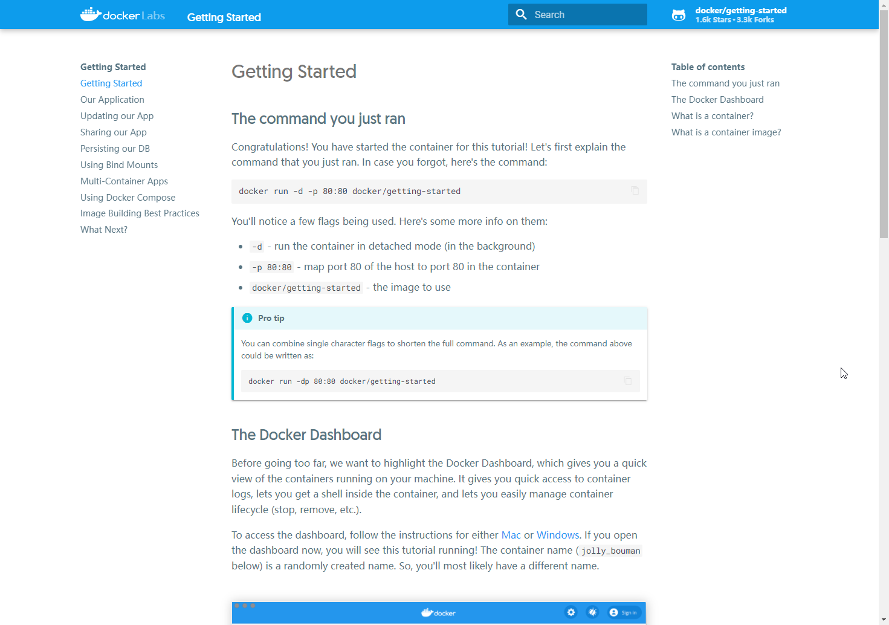

# 入门

安装略，参考：https://www.docker.com/

需要注意 docker 有两个版本：

* Docker CE (Community Edition): 社区版
* Docker EE (Enterprise Edition): 企业版

## 运行入门示例

首先参考官方示例，运行一下示例：


```bash
docker run -d -p 80:80 docker/getting-started
```

以上命令的意思是：
* `-d` \- 后台运行容器。
* `-p` \- 指定端口映射，格式：`宿主端口:容器端口`。
* `docker/getting-started` \- 使用的镜像。

成功运行后，可以在浏览器访问：http://localhost/tutorial/



以上示例中可以对单个字符配置进行缩写，`-d` 与 `-p` 可以缩写为 `-dp`，可以再运行一个镜像实例，将端口映射到 `2080`：

```bash
docker run -dp 2080:80 docker/getting-started
```

如果安装了 Docker Desktop 可以使用图形界面查看启动的容器并进行管理：


## 基本概念

Docker 是基于 Go 语言的开源应用容器引擎。

Docker 容器与虚拟机相似，但二者原理不同。

虚拟机虚拟化硬件，而容器将操作系统层虚拟化，所以更便携更高效。

* 镜像（Image）：Docker 镜像（Image），就相当于是一个 root 文件系统。
* 容器（Container）：镜像（Image）和容器（Container）的关系，就像是面向对象程序设计中的类和实例一样。镜像是静态的定义，容器是镜像运行时的实体。容器可以被创建、启动、停止、删除、暂停等。
* 仓库（Repository）：仓库可看成一个代码控制中心，用来保存镜像。


## 镜像加速

国内一部分加速服务：

* 科大镜像：https://docker.mirrors.ustc.edu.cn/
* 网易：https://hub-mirror.c.163.com/
* 阿里云：https://<你的ID>.mirror.aliyuncs.com
* 七牛云加速器：https://reg-mirror.qiniu.com

### Linux

`Ubuntu 16.04+` 、`Debian 8+`、 `CentOS 7` 等编辑或新建 `/etc/docker/daemon.json`，添加：

```json
{
    "registry-mirrors": [
        "https://reg-mirror.qiniu.com/"
    ]
}
```

然后重启服务：

```bash
sudo systemctl daemon-reload
sudo systemctl restart docker
```

### Windows

再 Docker Desktop 的配置中，编辑 Docker Engine：


如上图，添加加速服务地址，然后操作 `Apply & Restart`。