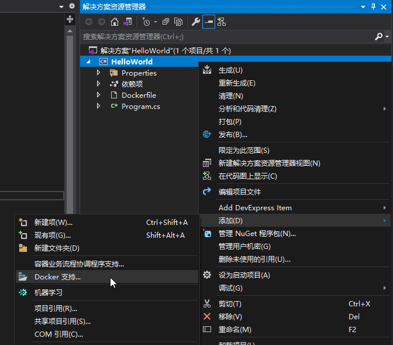
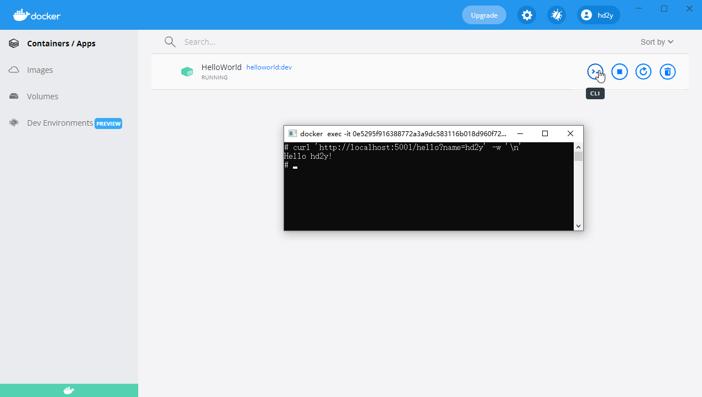

# Hello World

## 控制台

这里以一个 `.NET Core 3.1` 的控制台项目为例，Visual Studio 中可以直接为该项目添加 Docker 支持。



项目文件夹会自动创建 Dockerfile 文件，并构建镜像运行容器。

自动创建的 Dockfile 文件内容如下：

```Dockerfile
#See https://aka.ms/containerfastmode to understand how Visual Studio uses this Dockerfile to build your images for faster debugging.

FROM mcr.microsoft.com/dotnet/runtime:3.1 AS base
WORKDIR /app

FROM mcr.microsoft.com/dotnet/sdk:3.1 AS build
WORKDIR /src
COPY ["HelloWorld/HelloWorld.csproj", "HelloWorld/"]
RUN dotnet restore "HelloWorld/HelloWorld.csproj"
COPY . .
WORKDIR "/src/HelloWorld"
RUN dotnet build "HelloWorld.csproj" -c Release -o /app/build

FROM build AS publish
RUN dotnet publish "HelloWorld.csproj" -c Release -o /app/publish

FROM base AS final
WORKDIR /app
COPY --from=publish /app/publish .
ENTRYPOINT ["dotnet", "HelloWorld.dll"]
```

## Web

这里直接在原有的项目上做改造，首先修改项目类型为 `Web`。

将 `HelloWorld` 项目文件的 SDK 修改为 `Microsoft.NET.Sdk.Web`：

```xml
<Project Sdk="Microsoft.NET.Sdk.Web">

  <PropertyGroup>
    <OutputType>Exe</OutputType>
    <TargetFramework>netcoreapp3.1</TargetFramework>
    <DockerDefaultTargetOS>Linux</DockerDefaultTargetOS>
  </PropertyGroup>

  <ItemGroup>
    <PackageReference Include="Microsoft.VisualStudio.Azure.Containers.Tools.Targets" Version="1.11.1" />
  </ItemGroup>

</Project>
```

调整 `Program.cs` 文件，响应 `/hello` 路径下的请求：

```cs
using Microsoft.AspNetCore.Builder;
using Microsoft.AspNetCore.Hosting;
using Microsoft.AspNetCore.Http;
using Microsoft.Extensions.Hosting;
using System.Linq;

namespace HelloWorld
{
    class Program
    {
        public static void Main(string[] args) =>
           CreateHostBuilder(args).Build().Run();

        public static IHostBuilder CreateHostBuilder(string[] args) =>
            Host.CreateDefaultBuilder(args)
                .ConfigureWebHostDefaults(builder =>
                {
                    builder.Configure(app =>
                    {
                        app.UseRouting();
                        app.UseEndpoints(endpoints =>
                        {
                            endpoints.MapGet("/hello", async context =>
                            {
                                var name = context.Request.Query["name"];
                                await context.Response.WriteAsync($"Hello {(name.Count == 0 ? "world" : name.First())}!");
                            });
                        });
                    });
                });
    }
}
```

调整 Dockerfile，需要调整基础镜像为 `aspnet`。

然后使用 `EXPOSE` 将 5001 端口暴露到宿主机。

```Dockerfile
#See https://aka.ms/containerfastmode to understand how Visual Studio uses this Dockerfile to build your images for faster debugging.

FROM mcr.microsoft.com/dotnet/core/aspnet:3.1 AS base
WORKDIR /app
EXPOSE 5001

FROM mcr.microsoft.com/dotnet/sdk:3.1 AS build
WORKDIR /src
COPY ["HelloWorld/HelloWorld.csproj", "HelloWorld/"]
RUN dotnet restore "HelloWorld/HelloWorld.csproj"
COPY . .
WORKDIR "/src/HelloWorld"
RUN dotnet build "HelloWorld.csproj" -c Release -o /app/build

FROM build AS publish
RUN dotnet publish "HelloWorld.csproj" -c Release -o /app/publish

FROM base AS final
WORKDIR /app
COPY --from=publish /app/publish .
ENTRYPOINT ["dotnet", "HelloWorld.dll", "--urls", "http://*:5001"]
```

然后就可以重新运行该项目，因为当前调试状态下，启动的容器并没有与宿主机端口绑定，所以使用 Docker CLI 可以测试访问：

```bash
curl 'http://localhost:5001/hello?name=hd2y'
```



## 创建镜像

进入解决方案所在路径，执行以下命令构建镜像：

```bash
docker build -t helloworld:v1.0.0 -f ./HelloWorld/Dockerfile ./
```

注意，以上指定了镜像的名称 `helloworld`，以及版本 `tag` 为 `v1.0.0`。

构建以后，就可以使用以下命令创建容器：

```bash
docker run -dp 5001:5001 helloworld:v1.0.0
```

> 注意：`ASP.NET Core` 指定监听端口要使用 `http://*:5001`，否则可能出现 `ERR_EMPTY_RESPONSE` 错误。